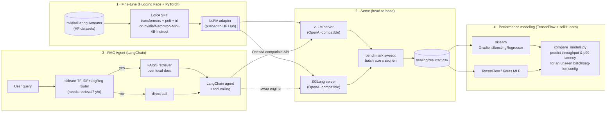

# Nemotron RAG Serving Lab

A small, end-to-end LLM systems project: **LoRA fine-tune NVIDIA's own [`Nemotron-Mini-4B-Instruct`](https://huggingface.co/nvidia/Nemotron-Mini-4B-Instruct)** with Hugging Face + PyTorch, **serve it two ways — vLLM and SGLang — and benchmark them head-to-head**, wrap the served model in a **LangChain** retrieval-augmented agent, and then train **scikit-learn** and **TensorFlow** models on the collected benchmark data to *predict* serving throughput/latency from batch size, sequence length, and engine — a small capacity-planning tool built from the project's own measurements.

Every box below is real, runnable code. Anything that needs a GPU is written as a Colab notebook (free T4) so it's reproducible by anyone, not just claimed.

## Why this project

Built to line up, piece by piece, with this requirement:

> *"AI tools & ML Frameworks: Deep experience building with LangChain, Hugging Face libraries, vLLM, and SGLang. Experience with ML frameworks like TensorFlow, PyTorch and Scikit-learn."*

| Requirement | Where it's demonstrated |
|---|---|
| **Hugging Face libraries** | `transformers`, `datasets`, `peft`, `accelerate`, `bitsandbytes`, `trl` used end-to-end in [`finetune/`](finetune/) to LoRA-tune `nvidia/Nemotron-Mini-4B-Instruct` on `nvidia/Daring-Anteater` |
| **PyTorch** | The training backbone under `transformers`/`peft` in [`finetune/02_lora_finetune.ipynb`](finetune/02_lora_finetune.ipynb); also the runtime under vLLM/SGLang |
| **vLLM** | OpenAI-compatible server + LoRA adapter serving + a batch/seq-length throughput-latency sweep in [`serving/vllm/`](serving/vllm/) |
| **SGLang** | OpenAI-compatible server + the same sweep, plus a constrained/structured-JSON generation demo (RadixAttention prefix caching) in [`serving/sglang/`](serving/sglang/) |
| **LangChain** | A retrieval-augmented, tool-calling agent in [`rag_agent/agent.py`](rag_agent/agent.py) that talks to whichever engine (vLLM or SGLang) is running, over its OpenAI-compatible endpoint |
| **TensorFlow** | A small Keras MLP in [`perf_modeling/train_tf_model.py`](perf_modeling/train_tf_model.py) that predicts serving throughput/latency from the benchmark data |
| **Scikit-learn** | Two roles: (1) a gradient-boosted baseline in [`perf_modeling/train_sklearn_regressor.py`](perf_modeling/train_sklearn_regressor.py) compared against the TensorFlow model, and (2) a TF-IDF + logistic-regression query router in [`rag_agent/router_baseline_sklearn.py`](rag_agent/router_baseline_sklearn.py) that decides when a query even needs the LLM/retrieval path at all |

## Status

- ✅ **Fine-tuned** — LoRA adapter trained and pushed: [`abdelwb/nemotron-mini-4b-daring-anteater-lora`](https://huggingface.co/abdelwb/nemotron-mini-4b-daring-anteater-lora) (800 examples, 1 epoch, train loss 1.28→1.15, eval loss 1.29 — a small run sized to finish on a free Colab T4; see [`docs/architecture.md`](docs/architecture.md) for why and how to scale it up with more GPU budget).
- ⬜ **Serve + benchmark** (vLLM vs. SGLang), **RAG agent**, **performance models** — code is complete and tested; not yet run end-to-end. See [Quickstart](#quickstart) below.

## Architecture



## Repo layout

```
nemotron-rag-serving-lab/
├── finetune/            # HF + PyTorch: LoRA SFT notebooks (Colab, free T4)
├── serving/
│   ├── vllm/            # OpenAI-compatible server + throughput/latency sweep
│   ├── sglang/          # same, plus structured/JSON-constrained generation demo
│   └── results/         # benchmark CSVs + the written-up comparison report
├── rag_agent/           # LangChain retrieval agent + sklearn query router
├── perf_modeling/       # sklearn + TensorFlow models trained on serving/results
├── notebooks/           # single Colab walkthrough tying all four stages together
├── tests/               # CPU-only unit tests (router, perf models) — see CI
└── docs/architecture.md # design notes and methodology
```

## Quickstart

Everything that needs a GPU is a Colab notebook — open it, run it under your own Google + Hugging Face login, the outputs land back in this repo.

1. **Fine-tune** — open [`finetune/02_lora_finetune.ipynb`](finetune/02_lora_finetune.ipynb) in Colab (Runtime → T4 GPU). It logs into the HF Hub (`huggingface_hub.login()`, needs a free HF account + access token — [huggingface.co/settings/tokens](https://huggingface.co/settings/tokens)), trains a LoRA adapter, and pushes it to your own HF namespace. Already done for this repo's own run — see [Status](#status) — so you can point steps 2-4 straight at [`abdelwb/nemotron-mini-4b-daring-anteater-lora`](https://huggingface.co/abdelwb/nemotron-mini-4b-daring-anteater-lora) instead of re-running this step.
2. **Serve + benchmark** — on a Linux box with an NVIDIA GPU (a Colab/RunPod/Lambda instance, or your own): `pip install vllm` and `pip install sglang[all]`, then run `serving/vllm/serve_vllm.sh` and `serving/sglang/serve_sglang.sh` against your adapter, and `bench_vllm.py` / `bench_sglang.py` to populate `serving/results/*.csv`.
3. **RAG agent** — `pip install -r rag_agent/requirements.txt`, point `rag_agent/agent.py` at whichever server is running (`--base-url http://localhost:8000/v1`), and ask it questions over the docs you index with `ingest.py`.
4. **Performance models** — once you have real rows in `serving/results/`, `python perf_modeling/train_sklearn_regressor.py` and `python perf_modeling/train_tf_model.py`, then `python perf_modeling/compare_models.py` to see both models' predictions side by side.

Full step-by-step (including exact CLI flags and expected runtimes) is in [`docs/architecture.md`](docs/architecture.md).

## Results

This section is intentionally a template, not invented numbers — it gets filled in from your own run of steps 2 and 4 above:

| Engine | Batch size | Seq len (in/out) | Throughput (tok/s) | p50 latency | p99 latency |
|---|---|---|---|---|---|
| vLLM | — | — | — | — | — |
| SGLang | — | — | — | — | — |

See [`serving/results/benchmark_report.md`](serving/results/benchmark_report.md) for the methodology and the script that regenerates this table.

## Design notes

- **Why `Nemotron-Mini-4B-Instruct`**: it's small enough to LoRA-tune and serve on a single free-tier T4 (fits in ~8-10GB in bf16, less in 4-bit), and it's NVIDIA's own model — fine-tuning and serving it is a more direct demonstration than picking an unrelated base model.
- **Why compare vLLM *and* SGLang instead of picking one**: they optimize the same problem (KV-cache reuse, continuous batching) differently — PagedAttention vs. RadixAttention — and the honest way to know which fits a given workload is to measure both, not assume.
- **Why scikit-learn shows up twice**: once as a *baseline model* for the throughput/latency prediction (a place a simpler model may be perfectly adequate against a small tabular dataset), and once as a *routing gate* in front of the LLM (not every query needs retrieval or generation — cheap classical ML deciding that is a real efficiency win, not a toy example).

## References

Built on top of, and informed by, these projects — cited here as prior art, not represented as this repo's own:

- [nvidia/Nemotron-Mini-4B-Instruct](https://huggingface.co/nvidia/Nemotron-Mini-4B-Instruct) and [nvidia/Daring-Anteater](https://huggingface.co/datasets/nvidia/Daring-Anteater) on the Hugging Face Hub — check their model/dataset cards for current license terms before any reuse beyond this kind of research/demo project.
- [huggingface/transformers](https://github.com/huggingface/transformers), [huggingface/peft](https://github.com/huggingface/peft), [huggingface/accelerate](https://github.com/huggingface/accelerate), [huggingface/trl](https://github.com/huggingface/trl)
- [vllm-project/vllm](https://github.com/vllm-project/vllm) — benchmark methodology adapted from [`benchmarks/`](https://github.com/vllm-project/vllm/tree/main/benchmarks) in the official repo
- [sgl-project/sglang](https://github.com/sgl-project/sglang)
- [langchain-ai/langchain](https://github.com/langchain-ai/langchain)
- [ak736/Fine-Tuning-NVIDIA-Nemotron](https://github.com/ak736/Fine-Tuning-NVIDIA-Nemotron) — a community LoRA fine-tune of this same base model, useful prior art for Colab T4 memory budgeting

## License

Code in this repo is MIT-licensed (see [`LICENSE`](LICENSE)). The base model and dataset are NVIDIA's own and carry their own license terms — read their model/dataset cards on the Hugging Face Hub before any use beyond this project.
